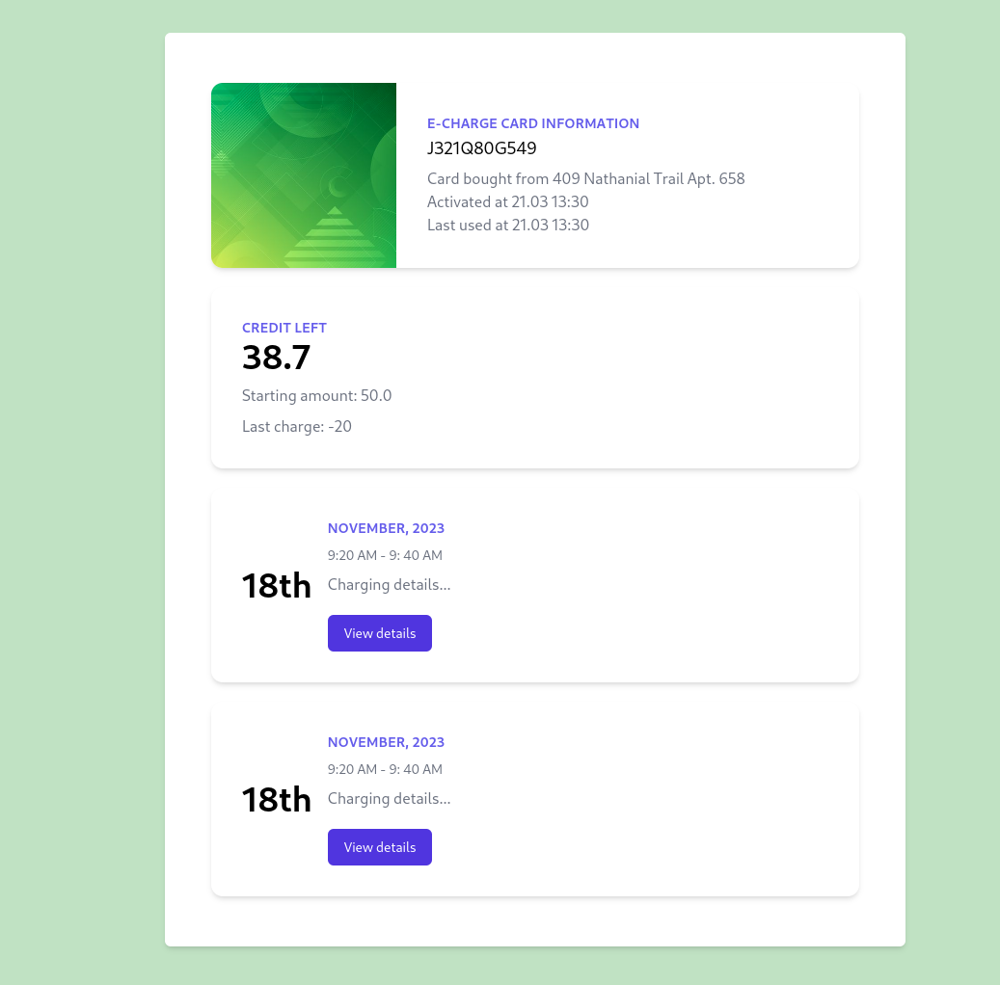

<p align="center"><a href="https://laravel.com" target="_blank"></a></p>

# Currently in development



This Laravel application offers a convenient way to manage and track your charging card information.  Key features include:

- Web UI: View your card balance, recent transactions, and other details through a user-friendly web interface.
- API Access: Retrieve card data programmatically using a simple REST API, enabling integration with other applications.

## Current Functionality

- Web Interface: The foundation of the web UI is in place, providing the ability to view basic card details.
- API Endpoint: Fetch basic card information

## API Usage

1. Cards

## Get a specific card

- Method: `GET`
- Route: `/card`
- Parameters:
    - `card_slug` (required): Filter by card's unqiue slug
    - `pin` (required): Filter by card's unqiue PIN
- Example requests:
    - `/card?card_slug=R534I15U963&pin=1397`
- Example Respone:
```json
{
    "id": 15,
    "slug": "R534I15U963",
    "amount_left": "23.8",
    "store": {
        "name": "Watsica, Schowalter and Brekke",
        "address": "409 Nathanial Trail Apt. 658"
    }
}
```

2. Stores

## Get all Stores

- Method: `GET`
- Route: `/stores`
- Example Respone:
```json
[
    {
        "id": 1,
        "name": "Gutmann LLC",
        "address": "250 Orpha Freeway",
        "city": "Osijek"
    },
    {
        "id": 2,
        "name": "Kirlin Ltd",
        "address": "52162 Schiller Isle",
        "city": "Osijek"
    },
...
]
```

## Get a specific Store
- Method: `GET`,
- Route: `/stores`,
- Parameters:
    - `id` (optional): Filter by store ID
    - `city` (optional): FIlter by store location
- Example requests:
    - `/stores?id=2` (Get store with ID 2)
    - `/stores?city=Zagreb` (Get all stores within Zagreb)
    - `/stores?city=xxxx` (Error message "Data not found." with a server response `406`)
- Example response:
```json
[
    {
        "id": 4,
        "name": "Koepp-Kunze",
        "address": "491 Durgan Walk",
        "city": "Rijeka"
    },
    {
        "id": 12,
        "name": "Kunze Inc",
        "address": "6860 Block Meadows",
        "city": "Rijeka"
    }
]
```


Next on the list:
- [ ] Implement charging sessions table so users can view all past charging sessions from a given card
- [ ] Refactor controllers to adhere to restful principles
- [ ] Optimise database record fetching
- [x] Implement API requests to fetch card details
- [x] Set up database
- [x] Implement web interface

